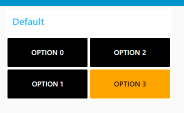

# Button State UI Widget for the NodeRed Dashboard
This is a simple widget for the NodeRed dashboard that displays many buttons that can be clicked to set a value, this value is then shown on the button's background color.

## Example interface


# Sending to input
Below is an example for setting the state on the widget
```
{
    "payload": "value"
}
```

# Output from the node
Below is an example of what will be output by the node (on the top output) when a button is clicked
```
{
    "payload": "value"
}
```

The node will also "request" an update on the bottom output with the following
```
{
    "payload": "current known value" //This will be "" when first deployed
}
```
It is expected that the node will be told it's value on the input when it requests this


# Example (Using colors) 

```
[{"id":"748117d.6a8a4e8","type":"ui_button_state","z":"1c5d828.a47687e","group":"fb4ca7c3.864058","name":"Example","order":0,"onColor":"","offColor":"","width":"6","height":"2","options":[{"label":"Option 0","value":"option_0","onColor":"#99ff99","offColor":"#ff3333"},{"label":"Option 1","value":"option_1","onColor":"#99ff99","offColor":"#ff3333"},{"label":"Option 2","value":"option_2","onColor":"#99ff99","offColor":"#ff3333"},{"label":"Option 3","value":"option_3","onColor":"#99ff99","offColor":"#ff3333"}],"x":540,"y":260,"wires":[["5474af6.bc2735","dbaff572.416f78"],["478f72be.78290c"]]},{"id":"5474af6.bc2735","type":"function","z":"1c5d828.a47687e","name":"Pass","func":"return msg;","outputs":1,"noerr":0,"initialize":"","finalize":"","x":550,"y":180,"wires":[["748117d.6a8a4e8"]]},{"id":"dbaff572.416f78","type":"debug","z":"1c5d828.a47687e","name":"","active":true,"tosidebar":true,"console":false,"tostatus":false,"complete":"true","targetType":"full","statusVal":"","statusType":"auto","x":730,"y":260,"wires":[]},{"id":"478f72be.78290c","type":"function","z":"1c5d828.a47687e","name":"Default","func":"return {\n    \"payload\": \"option_3\"\n}","outputs":1,"noerr":0,"initialize":"","finalize":"","x":540,"y":340,"wires":[["748117d.6a8a4e8"]]},{"id":"fb4ca7c3.864058","type":"ui_group","name":"Default","tab":"64be35cd.7831bc","order":1,"disp":true,"width":"6","collapse":false,"className":""},{"id":"64be35cd.7831bc","type":"ui_tab","name":"Home","icon":"dashboard","disabled":false,"hidden":false}]
```

# Example (Using classes) 

```
[{"id":"5474af6.bc2735","type":"function","z":"1c5d828.a47687e","name":"Pass","func":"return msg;","outputs":1,"noerr":0,"initialize":"","finalize":"","x":550,"y":180,"wires":[["68f74b7d.7e4864"]]},{"id":"dbaff572.416f78","type":"debug","z":"1c5d828.a47687e","name":"","active":true,"tosidebar":true,"console":false,"tostatus":false,"complete":"true","targetType":"full","statusVal":"","statusType":"auto","x":730,"y":260,"wires":[]},{"id":"478f72be.78290c","type":"function","z":"1c5d828.a47687e","name":"Default","func":"return {\n    \"payload\": \"option_3\"\n}","outputs":1,"noerr":0,"initialize":"","finalize":"","x":540,"y":340,"wires":[["68f74b7d.7e4864"]]},{"id":"68f74b7d.7e4864","type":"ui_button_state","z":"1c5d828.a47687e","group":"fb4ca7c3.864058","name":"","order":1,"onClass":"onColor","offClass":"offColor","width":"6","height":"2","options":[{"label":"Option 0","value":"option_0","onColor":"#99ff99","offColor":"#ff3333"},{"label":"Option 1","value":"option_1","onColor":"#99ff99","offColor":"#ff3333"},{"label":"Option 2","value":"option_2","onColor":"#99ff99","offColor":"#ff3333"},{"label":"Option 3","value":"option_3","onColor":"#99ff99","offColor":"#ff3333"}],"x":550,"y":260,"wires":[["5474af6.bc2735","dbaff572.416f78"],["478f72be.78290c"]]},{"id":"85965edc.72971","type":"ui_template","z":"1c5d828.a47687e","group":"2a745e6b.07df92","name":"Add Styling","order":2,"width":0,"height":0,"format":"<div>\n    <style>\n        .offColor {\n            color: white !important;\n            background-color: black !important;\n        }\n        .onColor {\n            color: black !important;\n            background-color: orange !important;\n        }\n    </style>\n</div>","storeOutMessages":true,"fwdInMessages":true,"resendOnRefresh":false,"templateScope":"global","className":"","x":550,"y":120,"wires":[[]],"icon":"node-red-dashboard/ui_colour_picker.png","info":"# Modern Dark Theme for node-red-dashboard\n\nInspired by Victor Lucachi with his [Node Red Dashboard Concept](https://dribbble.com/shots/10356530-Node-Red-Dashboard-Concept) on Dribbble. Thank you for your work.\n\n## Customize\n\n1. Go on dashboard customisation tab (At the right of Debug Console).\n2. Select the style `Dark`.\n3. Pick the color you want. Example `#66B5F8`\n\n## Buttons\n\nUse `2x2` size for buttons with icon and text on the screenshot"},{"id":"fb4ca7c3.864058","type":"ui_group","name":"Default","tab":"64be35cd.7831bc","order":1,"disp":true,"width":"6","collapse":false,"className":""},{"id":"2a745e6b.07df92","type":"ui_group","name":"Default","tab":"e63bce2d.68925","order":5,"disp":true,"width":"6","collapse":true},{"id":"64be35cd.7831bc","type":"ui_tab","name":"Home","icon":"dashboard","disabled":false,"hidden":false},{"id":"e63bce2d.68925","type":"ui_tab","name":"Denon","icon":"dashboard","order":2,"disabled":false,"hidden":false}]
```